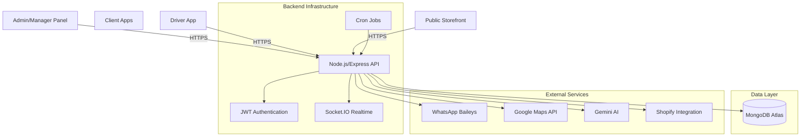
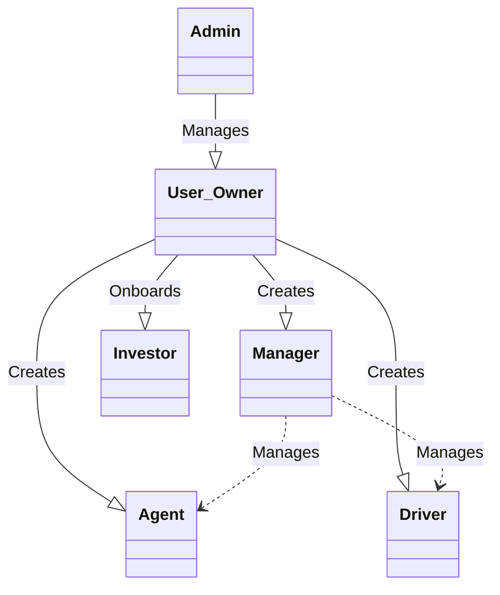
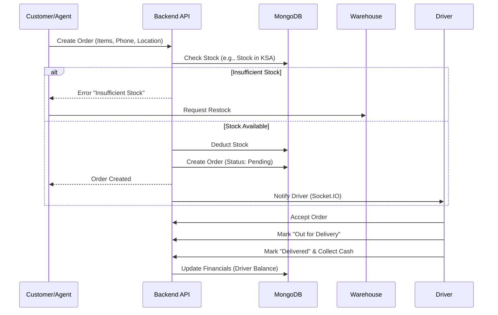

# Complete System Flow - VITALBLAZE Commerce

> [!IMPORTANT]
> This document provides a comprehensive "A to Z" overview of the VITALBLAZE Commerce ecosystem, detailing every role, workflow, and system interaction.

## 1. System Architecture

The VITALBLAZE platform is built on a modern, scalable **MERN stack** (MongoDB, Express, React, Node.js) designed for high-performance e-commerce and logistics management.

## 2. User Roles & Hierarchy

The system enforces a strict hierarchy to manage operations across multiple countries.

| Role | Access Level | Responsibilities |
| :--- | :--- | :--- |
| **Admin** | System-Wide | Full control over all users, system settings, and global reporting. |
| **User (Owner)** | Workspace Owner | Manages their own business unit: products, staff (managers, agents, drivers), and finances. |
| **Manager** | Workspace Admin | Assists the Owner. detailed permissions (e.g., `canCreateOrders`, `canManageProducts`). |
| **Agent** | Employee | Handles customer support, order creation, and inquiries. |
| **Driver** | Logistics | Delivers orders. constrained to specific countries (e.g., UAE, KSA). |
| **Investor** | Stakeholder | Invests in specific products/countries and earns profit share. |
| **Dropshipper** | Partner | Sells products at a markup; earns the difference as profit. |

### Role Hierarchy Diagram

## 3. Core Workflows

### A. Authentication Flow
Secure access using JWT (JSON Web Tokens).
- **Login**: Validates email/password. Supports "Staff Login" vs "Customer Login".
- **Security**: Rate limiting (prevent brute force), `bcrypt` password hashing.
- **Session**: 7-day token expiry.

### B. Order Fulfillment Lifecycle
The heart of the system. Orders are validated against **Country-Specific Stock**.

### C. Financial & Remittance Flow
Drivers collect Cash on Delivery (COD) and must remit funds to Managers/Owners.

1. **Collection**: Driver delivers order -> collects COD -> `driverProfile.totalCash` increases.
2. **Remittance Request**: Driver creates a remittance request for the collected amount.
3. **Verification**: Manager checks physical cash/bank transfer.
4. **Approval**: Manager approves remittance -> `driverProfile.totalCash` decreases -> `CompanyRevenue` increases.

### D. Investor Profit Distribution
Investors fund stock for specific products in specific countries.

- **Investment**: Investor creates a "Plan" (e.g., 500 units of "Shampoo" in "UAE").
- **Sales**: When "Shampoo" is sold in "UAE", profit is calculated.
- **Allocation**: Profit is automatically assigned to the Investor's ledger.
- **Payout**: Investor requests withdrawal -> Admin approves.

## 4. Advanced Features

### 📦 Multi-Country Inventory
Products have distinct stock levels for each region:
- **UAE** (United Arab Emirates)
- **KSA** (Saudi Arabia)
- **OM** (Oman)
- **BH** (Bahrain)
- **KW** (Kuwait)
- **QA** (Qatar)
- **IN** (India)

### 🤖 AI Integration
- **Product Descriptions**: Uses **Gemini AI** to generate marketing copy from basic details.
- **Image Generation**: Creates professional product photos using prompts.

### 📱 Connectivity
- **WhatsApp**: Automated welcome messages, order updates, and OTPs via `@whiskeysockets/baileys`.
- **Real-Time**: `Socket.IO` powers live dashboards for Managers and Drivers.

## 5. Database Schema Overview

> [!NOTE]
> Key Mongoose Models defining the system's data structure.

- **User**: Stores profile, role, permissions, and hierarchy links (`createdBy`).
- **Product**: Stores details, pricing, `stockByCountry` map, and `stockHistory`.
- **Order**: Massive document containing customer info, cart items, shipment status, and delivery logs.
- **Remittance**: Financial transaction records between Driver and Company.
- **DailyProfit**: Tracks system daily performance for analytics.
- **Notification**: System alerts for users.
